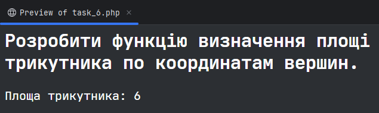

# Практична робота №6 (PHP)
**Виконав: Жеревчук Сергій, 34 група**


## Завдання 1
- Розробити функцію, яка визначає максимальне з трьох чисел

```php
<link rel="stylesheet" href="style.css">

<h2>Розробити функцію, яка визначає максимальне з трьох чисел.</h2>

<?php
    function max_number($num_1, $num_2, $num_3)
    {
        return max($num_1, $num_2, $num_3);
    }

    echo "Максимальне число: " . max_number(1, 3, 2);
```


## Завдання 2
- Розробити функцію, яка визначає периметр трикутника

```php
<link rel="stylesheet" href="style.css">

<h2>Розробити функцію, яка визначає периметр трикутника.</h2>

<?php
    function triangle_is_valid($side_1, $side_2, $side_3)
    {
        return ($side_1 < ($side_2 + $side_3)) && ($side_2 < ($side_1 + $side_3)) && ($side_3 < ($side_1 + $side_2));
    }
    
    function perimeter_of_triangle($side_1, $side_2, $side_3)
    {
        if (!triangle_is_valid($side_1, $side_2, $side_3)) {
            return 0;
        }
        
        return $side_1 + $side_2 + $side_3;
    }

    echo "Периметр трикутника: " . perimeter_of_triangle(2, 3, 4);
```


## Завдання 3
- Розробити функцію, яка визначає периметр трикутника

```php
<link rel="stylesheet" href="style.css">

<h2>Розробити функцію визначення площі трикутника по трьом сторонам.</h2>

<?php
    function triangle_is_valid($side_1, $side_2, $side_3)
    {
        return ($side_1 < ($side_2 + $side_3)) && ($side_2 < ($side_1 + $side_3)) && ($side_3 < ($side_1 + $side_2));
    }
    
    function area_of_triangle($side_1, $side_2, $side_3)
    {
        if (!triangle_is_valid($side_1, $side_2, $side_3)) {
            return 0;
        }

        $p = ($side_1 + $side_2 + $side_3) / 2;
        
        return sqrt($p * ($p - $side_1) * ($p - $side_2) * ($p - $side_3));
    }

    echo "Площа трикутника: " . area_of_triangle(2, 3, 4);
```


## Завдання 4
- Розробити функцію визначення площі трикутника по трьом сторонам

```php
<link rel="stylesheet" href="style.css">

<h2>Розробити функцію визначення площі трикутника по трьом сторонам.</h2>

<?php
    function triangle_is_valid($side_1, $side_2, $side_3)
    {
        return ($side_1 < ($side_2 + $side_3)) && ($side_2 < ($side_1 + $side_3)) && ($side_3 < ($side_1 + $side_2));
    }
    
    function area_of_triangle($side_1, $side_2, $side_3)
    {
        if (!triangle_is_valid($side_1, $side_2, $side_3)) {
            return 0;
        }

        $p = ($side_1 + $side_2 + $side_3) / 2;
        
        return sqrt($p * ($p - $side_1) * ($p - $side_2) * ($p - $side_3));
    }

    echo "Площа трикутника: " . area_of_triangle(2, 3, 4);
```


## Завдання 5
- Розробити функцію виведення імені у стовпчик декілька раз

```php
<link rel="stylesheet" href="style.css">

<h2>Розробити функцію виведення імені у стовпчик декілька раз.</h2>

<?php
    function wrap_word($word, $repetitions)
    {
        for ($i = 0; $i < $repetitions; $i++) {
            for ($j = 0; $j < strlen($word); $j++) {
                echo substr($word, $j, 1) . "<br>";
            }
            
            echo "<br>";
        }
    }
    
    wrap_word("Bruh", 3);
```


## Завдання 6
- Розробити функцію визначення площі трикутника по координатам вершин

```php
<link rel="stylesheet" href="style.css">

<h2>Розробити функцію визначення площі трикутника по координатам вершин.</h2>

<?php
    function triangle_area($Ax, $Ay, $Bx, $By, $Cx, $Cy)
    {
        $ABx = $Bx - $Ax;
        $ABy = $By - $Ay;
        $ACx = $Cx - $Ax;
        $ACy = $Cy - $Ay;

        $p = $ABx * $ACy - $ABy * $ACx;

        return abs($p) / 2;
    }

    echo "Площа трикутника: " . triangle_area(0, 0, 4, 0, 2, 3);
```


